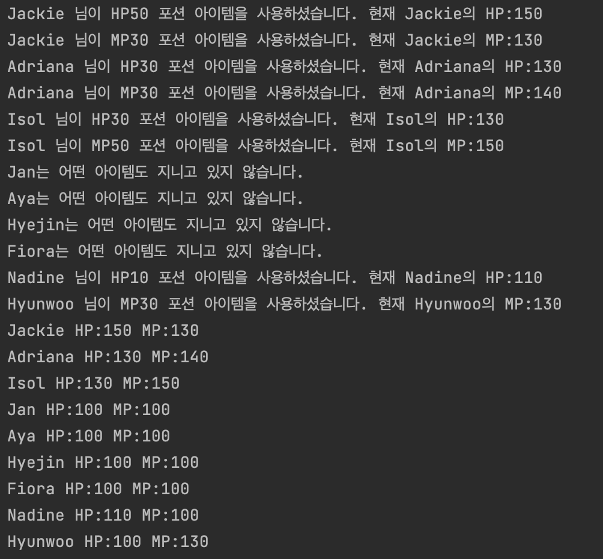
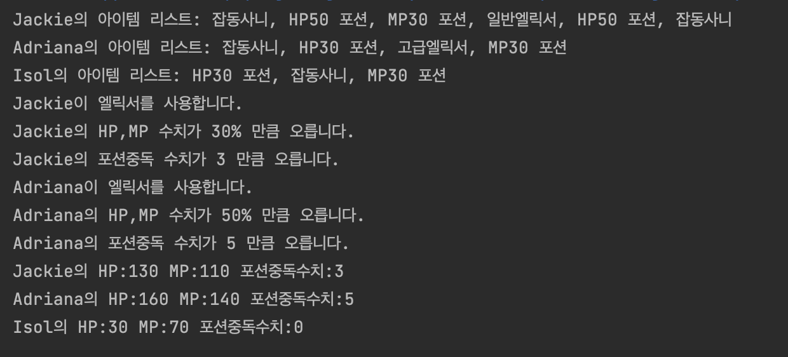
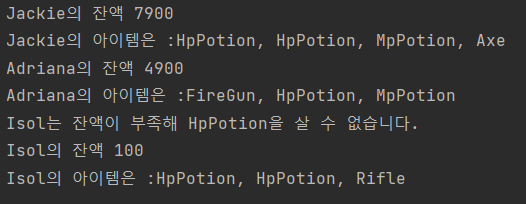
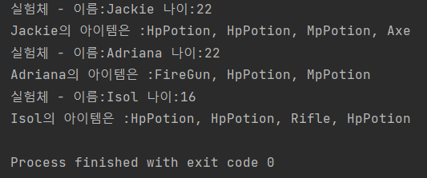
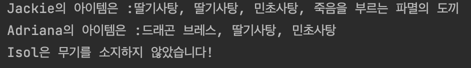
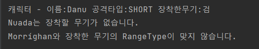

# 더큰내일센터 BackEnd Study Git

위 스터디는 **더큰내일센터 백엔드 스터디 원**의 **자바**에 대한 **이해**와 **사용 능력**을 **증진**하고

더 나아가 **자바 언어로 원활한 프로그래밍을 하기 위한 스터디**입니다.

**주간 일정**

**월: 알고리즘 문제 풀이**

**화: 클래스 문제 풀이**

**수: 클래스 문제 풀이**

​                                                                                                                            

**풀어오지 못할시 벌칙 : 미정**

**일정**

**2023:**

**5월문제:**

**5월 2주차**

5월 2주차 문제

5/8 문제

- 백준 알고리즘 : 과제 안내신분?  - 기초 배열 문제
  - https://www.acmicpc.net/problem/5597 

- 백준 알고리즘 : 공 바꾸기 - 기초 배열 문제
  - https://www.acmicpc.net/problem/10813
  
- 프로그래머스 알고리즘 : n보다 커질 때까지 더하기 - 배열 및 조건 문 문제
  - https://school.programmers.co.kr/learn/courses/30/lessons/181884

5/9 문제

- **상속과 배열에 관한 이해**를 돕기 위한 **클래스 및 메소드 작성문제**
  - 조건1 : problem 패키지 내부의 **_5_9 패키지를 복사**하여 자신의 이름의 패키지에서 문제를 푸세요
  - 조건2 : **JdncClassTest1을 실행**했을때 **아래와 같은 결과 화면이 출력**되어야 합니다.
  - 조건3: Test를 풀기 위해 ChildrenDistibution Class와 해당 클래스의 convertMember메소드를 작성해주세요. - 다른 클래스가 필요하다면 다른 클래스를 생성해주세요
  - 조건4 : JdncClassTest1 Class를 수정하지 마세요.
  - 조건5: Member Class를 수정하지 마세요.

- 조건 4과 5는 지키지 않으셔도 되지만 가능한 지켜주시면 실력향상에 도움이 됩니다.
- 클래스와 메소드를 직접 만들어 보시고 그 과정에서 일어나는 고민과 생각을 정리해서 다른분들과 공유해 봅시다!

- **결과 화면**
- 

 5/10 문제

- **상속과 배열 그리고 자료구조 Map에 관한 이해**를 돕기 위한 **클래스 및 메소드 작성문제**
  - 조건1 : problem 패키지 내부의 **_5_10 패키지를 복사**하여 자신의 이름의 패키지에서 문제를 푸세요
  - 조건2 : **JdncClassTest2을 실행**했을때 **아래와 같은 결과 화면이 출력**되어야 합니다.
  - 조건3 : Test를 풀기 위해 **WeaponProvider** Class와 해당 클래스의 **provideWeaponToMember** 메소드를 작성해주세요. 
  - 조건4 : 문제를 풀기위해 **필요한 클래스를 스스로 작성**하세요. (작성 중 다른 클래스와 차이점이 없는 클래스는 작성하지 말아주세요)
  - 조건5 : Member Class를 수정하지 마세요
  - 조건6 : Weapon Class를 수정하지 마세요
  - 조건7 : JdncClassTest2를 수정하지 마세요
- 조건 5,6,7은 지키지 않으셔도 되지만 가능한 지켜주시면 실력향상에 도움이 됩니다.
- 클래스와 메소드를 직접 만들어 보시고 그 과정에서 일어나는 고민과 생각을 정리해서 다른분들과 공유해 봅시다!

Hint

멤버 변수와 메소드들중 익숙하지 않은 접근제어자가 보이실 겁니다.

**5월 3주차**

5월 3주차 문제

5/15 문제

- 백준 알고리즘 : 세로읽기?  - 배열
  - https://www.acmicpc.net/problem/10798

- 백준 알고리즘 : 색종이 - 배열
  - https://www.acmicpc.net/problem/2563

- 프로그래머스 알고리즘 : 가장 가까운 같은 글자
  - https://school.programmers.co.kr/learn/courses/30/lessons/142086

5/16 문제

- **상속과 다운 캐스팅 그리고 파싱**에 관한 이해를 를 돕기 위한 **메소드 작성문제**
  - 조건1 : problem 패키지 내부의 **_5_16 패키지를 복사**하여 자신의 이름의 패키지에서 문제를 푸세요
  - 조건2 : **JdncClassTest3을 실행**했을때 **아래와 같은 결과 화면이 출력**되어야 합니다.
  - 조건3 : Test를 풀기 위해 **ItemProvider** Class와 해당 클래스의 **provideItem** 메소드를 작성해주세요.
  - 조건4 : Test를 풀기 위해 **Member** class 내부의 processingUseAllItem 메소드를 작성해 주세요
  - 조건5 : 조건 4 이외에는 Member Class를 수정하지 마세요
  - 조건6 : Item Class를 수정하지 마세요
  - 조건7 : JdncClassTest3를 수정하지 마세요
  - 조건8 : HpPotion, MpPotion class는 주석으로 안내되어있는 한줄 외에 수정하지 마세요
- 조건 5,6,7,8 은 지키지 않으셔도 되지만 가능한 지켜주시면 실력향상에 도움이 됩니다.
- Potion interface 는 사용하셔도 되고 사용하지 않으셔도 됩니다.
- 클래스와 메소드를 직접 만들어 보시고 그 과정에서 일어나는 고민과 생각을 정리해서 다른분들과 공유해 봅시다!

Hint

- down casting 과 this에 대해 아시면 풀이에 도움이 되실겁니다.

5/17 문제

- **상속과 다운 캐스팅 그리고 파싱**에 관한 이해를 를 돕기 위한 **메소드 작성문제**
  - 조건1 : problem 패키지 내부의 **_5_17 패키지를 복사**하여 자신의 이름의 패키지에서 문제를 푸세요
  - 조건2 : **JdncClassTest4을 실행**했을때 **아래와 같은 결과 화면이 출력**되어야 합니다.
  - 조건3 : Test를 풀기 위해 **ItemProvider** Class와 해당 클래스의 **provideItem** 메소드를 작성해주세요.
  - 조건4 : Test를 풀기 위해 **Member** class 내부의 firstElixirUse 메소드를 작성해 주세요
  - 조건5 : 조건 4 이외에는 Member Class를 수정하지 마세요
  - 조건6 : Item Class를 수정하지 마세요
  - 조건7 : JdncClassTest4를 수정하지 마세요
  - 조건8 : 구현되어 있는 기타 인터페이스들을 활용하여 문제를 풀어 주세요. - 수정은 금지
- 조건 5,6,7,8 은 지키지 않으셔도 되지만 가능한 지켜주시면 실력향상에 도움이 됩니다.
- 클래스와 메소드를 직접 만들어 보시고 그 과정에서 일어나는 고민과 생각을 정리해서 다른분들과 공유해 봅시다!

**5월 4주차**

5월 4주차 문제

5/22 문제

- 백준 알고리즘 : 블랙잭  - 브루트포스
  - https://www.acmicpc.net/problem/2798

- 프로그래머스 알고리즘 : 크레인 인형 뽑기
  - https://school.programmers.co.kr/learn/courses/30/lessons/64061

5/23 문제

- **디자인 패턴에 대한 이해를 높이기 위한 클래스 작성문제**
  - 조건1 : problem 패키지 내부의 **_5_23 패키지를 복사**하여 자신의 이름의 패키지에서 문제를 푸세요
  - 조건2 : **JdncClassTest5을 실행**했을때 **아래와 같은 결과 화면이 출력**되어야 합니다.
  - 조건3 : Test를 풀기 위해 **ItemList** Class를 올바르게 수정해 주세요
  - 조건4 : Test를 풀기 위해 **ItemSeller** class 를 작성해주세요
  - 조건6 : Item Class를 수정하지 마세요
  - 조건7 : JdncClassTest5 Class를 수정하지 마세요
  - 조건8 : Member Class를 수정하지 마세요
- 조건 6,7,8 은 지키지 않으셔도 되지만 가능한 지켜주시면 실력향상에 도움이 됩니다.
- 클래스와 메소드를 직접 만들어 보시고 그 과정에서 일어나는 고민과 생각을 정리해서 다른분들과 공유해 봅시다!

5/24 문제

- **디자인 패턴에 대한 이해를 높이기 위한 클래스 작성문제**
  - 조건1 : problem 패키지 내부의 **_5_24 패키지를 복사**하여 자신의 이름의 패키지에서 문제를 푸세요
  - 조건2 : **JdncClassTest6을 실행**했을때 **아래와 같은 결과 화면이 출력**되어야 합니다.
  - 조건3 : 테스트를 풀기 위해 **ItemProvider** Class를 수정해주세요
  - 조건4 : **JdncClassTest6** Class를 수정하지 마세요
  - 조건5 : **Member** Class를 수정하지 마세요
  - 조건6 : **ItemRepository** Class를 수정하지 마세요
  - 조건7 : **Item** Class를 수정하지 마세요
- 참고사항
  - 참고1 : **Dummy** Class는 테스트 초기 코드를 원활히 돌리기 위한 더미 클래스 입니다. **문제를 푸시고 삭제해 주세요.**
  - 참고2 : **ObjectFactory** Class는 수정하셔도 되고 그대로 사용하셔도 됩니다.
- 조건 4,5,6,7 은 지키지 않으셔도 되지만 가능한 지켜주시면 실력향상에 도움이 됩니다.
- 클래스와 메소드를 직접 만들어 보시고 그 과정에서 일어나는 고민과 생각을 정리해서 다른분들과 공유해 봅시다!

**5월 5주차**

5월 5주차 문제

5/30 문제

- 백준 알고리즘 : 균형잡힌 세상
  - https://www.acmicpc.net/problem/4949

- 백준 알고리즘 : 피보나치 수
  - https://www.acmicpc.net/problem/24416

- 프로그래머스 알고리즘 : 폰켓몬
  - https://school.programmers.co.kr/learn/courses/30/lessons/1845 

5/31 문제

- 백준 알고리즘 : 칸토어 집합
  - https://www.acmicpc.net/problem/4779

- 백준 알고리즘 : 큐2 
  - https://www.acmicpc.net/problem/18258

- 프로그래머스 알고리즘 : [1차] 비밀지도
  - https://school.programmers.co.kr/learn/courses/30/lessons/17681

**6월문제:**

**6월 1주차**

6월 1주차 문제

6/5 문제

- **자바 객체 다형성을 이해하기 위한 클래스 작성문제**
  - 조건1 : problem 패키지 내부의 **_6_5 패키지를 복사**하여 자신의 이름의 패키지에서 문제를 푸세요
  - 조건2 : **JdncClassTest7을 실행**했을때 **아래와 같은 결과 화면이 출력**되어야 합니다.
  - 조건3 : 테스트를 풀기 위해 **ItemProvider** Class를 수정해주세요
  - 조건4 : **JdncClassTest7** Class를 수정하지 마세요
  - 조건5 : **Member** Class를 수정하지 마세요
  - 조건6 : **Playable** Class를 수정하지 마세요
  - 조건7 : **Weapon** Class를 수정하지 마세요
  - 조건8 : **ItemRepository** Class를 수정하지 마세요
  - 조건9 : **Item** Class를 수정하지 마세요
  - 조건10 : **NotTakeWeaponException** Class를 수정하지 마세요
- 참고사항
  - 참고1 : **Dummy** Class는 테스트 초기 코드를 원활히 돌리기 위한 더미 클래스 입니다. **문제를 푸시고 삭제해 주세요.**
- 조건 4~10 은 지키지 않으셔도 되지만 가능한 지켜주시면 실력향상에 도움이 됩니다.
- 클래스와 메소드를 직접 만들어 보시고 그 과정에서 일어나는 고민과 생각을 정리해서 다른분들과 공유해 봅시다!

6/6 문제

- 백준 알고리즘 : 동전 0
  - https://www.acmicpc.net/problem/11047

- 백준 알고리즘 : N과 M (3)
  - https://www.acmicpc.net/problem/15651

- 뒤에 있는 큰 수 찾기
  - https://school.programmers.co.kr/learn/courses/30/lessons/154539

6/7 문제

- 백준 알고리즘 : 스택 수열
  - https://www.acmicpc.net/problem/1874

- 백준 알고리즘 : RGB거리
  - https://www.acmicpc.net/problem/1149

- 이모티콘 할인행사
  - https://school.programmers.co.kr/learn/courses/30/lessons/150368

**6월 2주차**

6월 2주차 문제

6/13 문제

- 백준 알고리즘 : 카드2
  - https://www.acmicpc.net/problem/2164

- 백준 알고리즘 : 프린터 큐
  - https://www.acmicpc.net/problem/1966

- 과일 장수
  - https://school.programmers.co.kr/learn/courses/30/lessons/135808

6/14 문제

- 백준 알고리즘 : 연산자 끼워넣기
  - https://www.acmicpc.net/problem/14888

- 백준 알고리즘 : 영화감독 숌
  - https://www.acmicpc.net/problem/1436

- 완주하지 못한 선수
  - https://school.programmers.co.kr/learn/courses/30/lessons/42576

**6월 3주차**

6월 3주차 문제

6/19 문제

- **자바 객체 다형성을 이해하기 위한 클래스 작성문제**
  - 조건1 : problem 패키지 내부의 **_6_19 패키지를 복사**하여 자신의 이름의 패키지에서 문제를 푸세요
  - 조건2 : **JdncClassTest8을 실행**했을때 **아래와 같은 결과 화면이 출력**되어야 합니다.
  - 조건3 : 테스트를 풀기 위해 **WeaponProvider** Class 를 수정해주세요
  - 조건4 : 필요하다면 다른 클래스를 작성해 주세요.
  - 조건5 : **WeaponProvider** Class 이외 다른 모든 Class 를 수정하지 마세요
  - 참고사항 : 멤버의 공격타입과 맞지 않거나 멤버에 해당하는 무기가 없는 경우를 처리해주세요.
- 클래스와 메소드를 직접 만들어 보시고 그 과정에서 일어나는 고민과 생각을 정리해서 다른분들과 공유해 봅시다!

6/20 문제

- 백준 알고리즘 : 수 찾기
  - https://www.acmicpc.net/problem/1920

- 백준 알고리즘 : 숫자 카드 2
  - https://www.acmicpc.net/problem/10816

- 디펜스 게임
  - https://school.programmers.co.kr/learn/courses/30/lessons/142085

6/21 문제

- 백준 알고리즘 : 랜선 자르기
  - https://www.acmicpc.net/problem/1654

- 백준 알고리즘 : 나무 자르기
  - https://www.acmicpc.net/problem/2805
  
- 조건에 부합하는 중고거래 상태 조회하기
  - https://school.programmers.co.kr/learn/courses/30/lessons/164672

**7월 문제:**

**7월 1주차**

7월 1주차 문제

7/3 문제

- 백준 알고리즘 : 포도주 시식
  - https://www.acmicpc.net/problem/2156

- 당구 연습
  - https://school.programmers.co.kr/learn/courses/30/lessons/169198

7/4 문제

- 백준 알고리즘 : 쉬운 계단 수
  - https://www.acmicpc.net/problem/10844

- 마법의 엘리베이터
  - https://school.programmers.co.kr/learn/courses/30/lessons/148653

