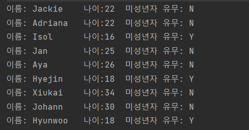
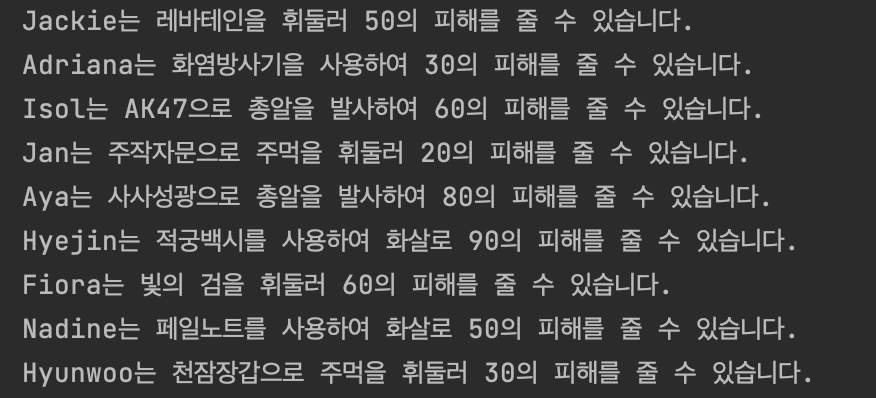

# 더큰내일센터 BackEnd Study Git

위 스터디는 **더큰내일센터 백엔드 스터디 원**의 **자바**에 대한 **이해**와 **사용 능력**을 **증진**하고

더 나아가 **자바 언어로 원활한 프로그래밍을 하기 위한 스터디**입니다.

**주간 일정**

**월: 알고리즘 문제 풀이**

**화: 클래스 문제 풀이**

**수: 클래스 문제 풀이**

​                                                                                                                            

**풀어오지 못할시 벌칙 : 미정**

**일정**

**2023:**

**5월문제:**

5월 2주차 문제

5/8 문제

- 백준 알고리즘 : 과제 안내신분?  - 기초 배열 문제
  - https://www.acmicpc.net/problem/5597 

- 백준 알고리즘 : 공 바꾸기 - 기초 배열 문제
  - https://www.acmicpc.net/problem/10813
  
- 프로그래머스 알고리즘 : n보다 커질 때까지 더하기 - 배열 및 조건 문 문제
  - https://school.programmers.co.kr/learn/courses/30/lessons/181884
  

5/9 문제

- **상속과 배열에 관한 이해**를 돕기 위한 **클래스 및 메소드 작성문제**
  - 조건1 : problem 패키지 내부의 **_5_9 패키지를 복사**하여 자신의 이름의 패키지에서 문제를 푸세요
  - 조건2 : **JdncClassTest1을 실행**했을때 **아래와 같은 결과 화면이 출력**되어야 합니다.
  - 조건3: Test를 풀기 위해 ChildrenDistibution Class와 해당 클래스의 convertMember메소드를 작성해주세요. - 다른 클래스가 필요하다면 다른 클래스를 생성해주세요
  - 조건4 : JdncClassTest1 Class를 수정하지 마세요.
  - 조건5: Member Class를 수정하지 마세요.

- 조건 4과 5는 지키지 않으셔도 되지만 가능한 지켜주시면 실력향상에 도움이 됩니다.
- 클래스와 메소드를 직접 만들어 보시고 그 과정에서 일어나는 고민과 생각을 정리해서 다른분들과 공유해 봅시다!

- **결과 화면**
- 

 5/10 문제

- **상속과 배열 그리고 자료구조 Map에 관한 이해**를 돕기 위한 **클래스 및 메소드 작성문제**
  - 조건1 : problem 패키지 내부의 **_5_10 패키지를 복사**하여 자신의 이름의 패키지에서 문제를 푸세요
  - 조건2 : **JdncClassTest2을 실행**했을때 **아래와 같은 결과 화면이 출력**되어야 합니다.
  - 조건3 : Test를 풀기 위해 **WeaponProvider** Class와 해당 클래스의 **convertMember** 메소드를 작성해주세요. 
  - 조건4 : 문제를 풀기위해 **필요한 클래스를 스스로 작성**하세요. (작성 중 다른 클래스와 차이점이 없는 클래스는 작성하지 말아주세요)
  - 조건5 : Member Class를 수정하지 마세요
  - 조건6 : Weapon Class를 수정하지 마세요
  - 조건7 : JdncClassTest2를 수정하지 마세요
- 조건 5,6,7은 지키지 않으셔도 되지만 가능한 지켜주시면 실력향상에 도움이 됩니다.
- 클래스와 메소드를 직접 만들어 보시고 그 과정에서 일어나는 고민과 생각을 정리해서 다른분들과 공유해 봅시다!

Hint

멤버 변수와 메소드들중 익숙하지 않은 접근제어자가 보이실 겁니다.

